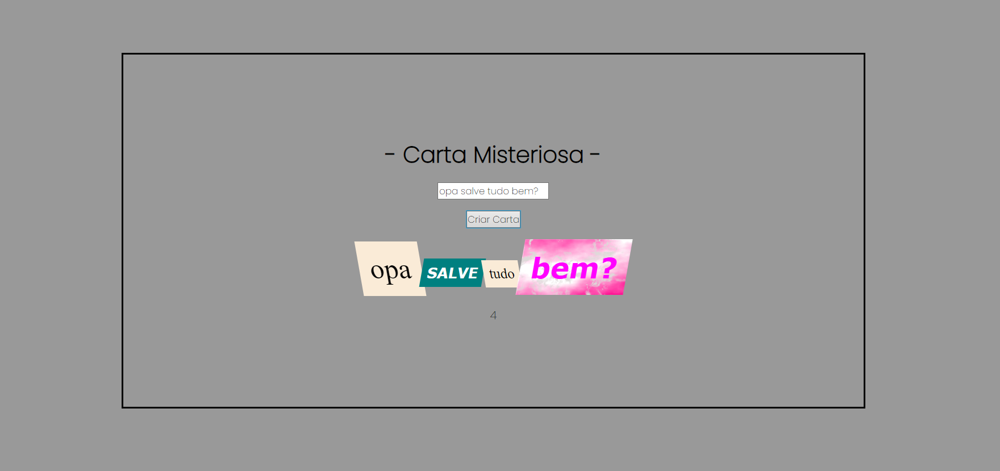

# Projeto Carta Misteriosa

### O objetivo desse projeto é o usuário conseguir escrever uma mensagem que será transformada em pequenos cards de tamanhos e formas diferentes!

 

 

### ==================== Tecnologias utilizadas ====================

- HTML
- CSS
- JAVASCRIPT

### ===============================================================

## Como instalar as dependências:

- npm install
- npm start

### ===============================================================

#### Projeto realizado em (01/2022)
